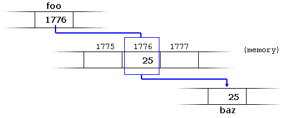
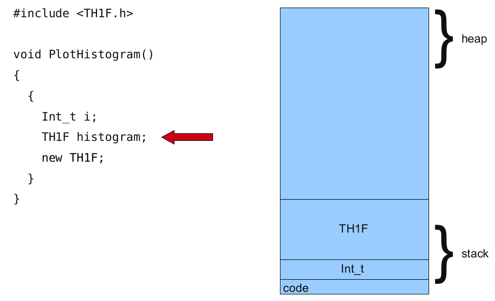
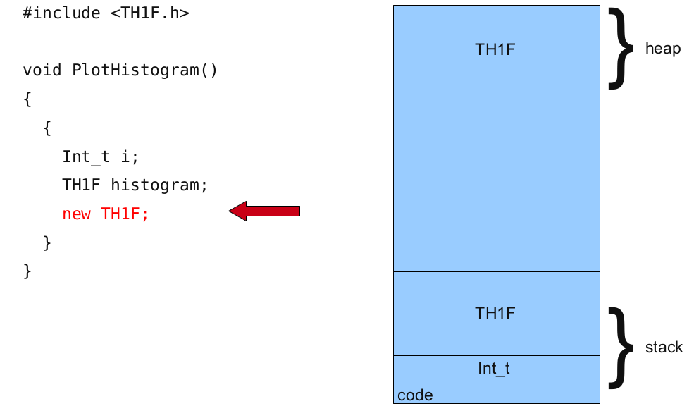
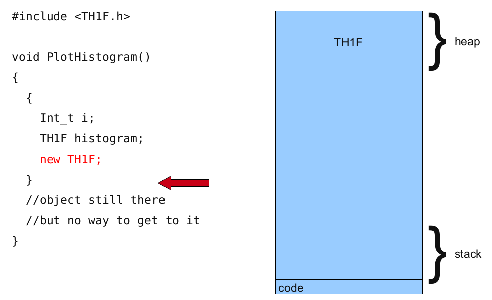
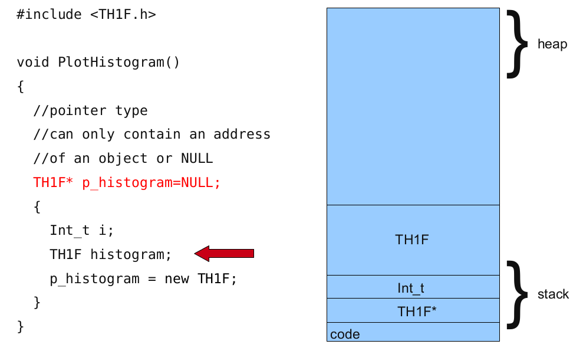
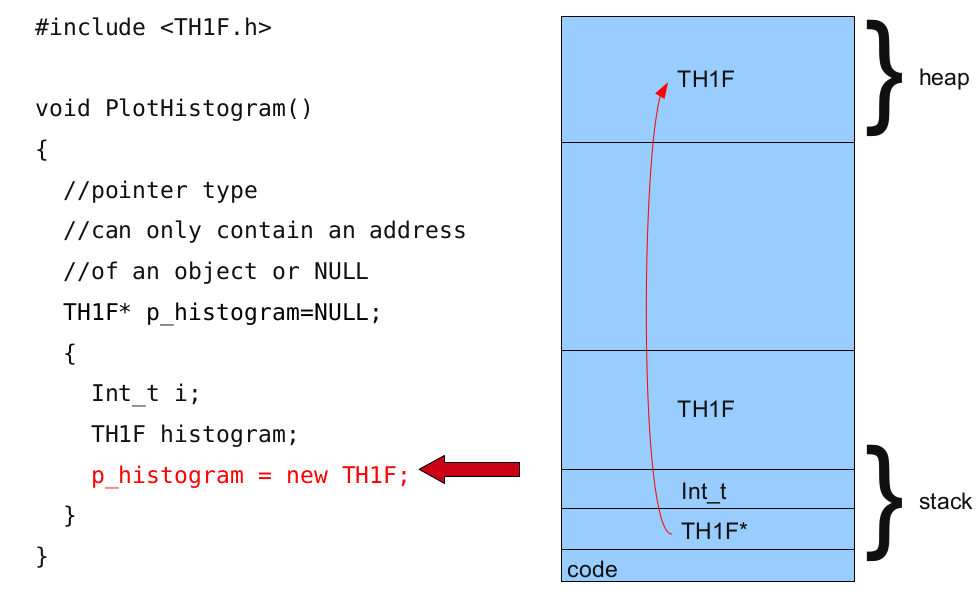
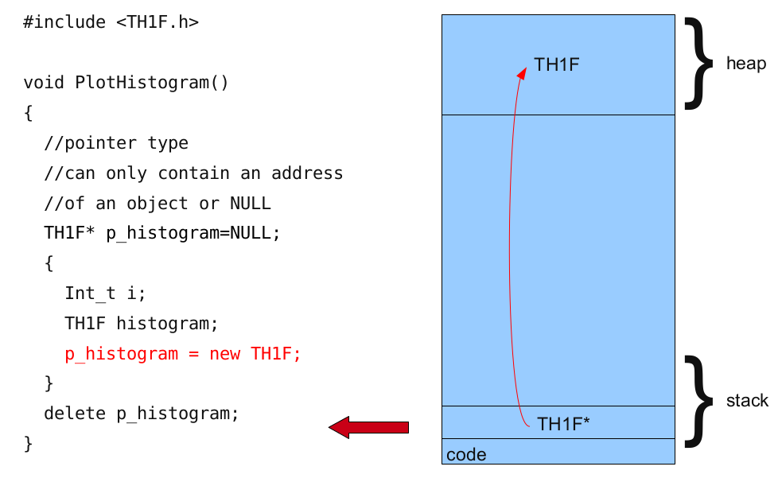

# The absolute basics

Of course, all of us remember from our C++ 101 class what a pointer is. Still, it cannot hurt to refresh the basics a little bit before we dive into the deep end. 

- When a variable is declared, the memory needed to store its value is assigned a specific location in memory: its memory address. 
- C++ programs do not actively decide the exact memory addresses where its variables are stored. 

Fortunately, that task is left to the environment where the program is run - generally, an operating system that decides the particular memory locations on runtime. However, it may be useful for a program to be able to obtain the address of a variable during runtime in order to access data cells that are at a certain position relative to it.

## The address-of operator &

The address of a variable can be obtained by preceding the name of a variable with an ampersand sign (&), known as address-of operator. For example: 

```cpp
foo = &myfar;
```

This assigns the *address* of variable `myvar` to `foo`; by preceding the name of the variable `myvar` with the address-of operator (&), we are no longer assigning the content of the variable itself to foo, but its address.


The actual address of a variable in memory cannot be known before runtime, but let's assume, in order to help clarify some concepts, that myvar is placed during runtime in the memory address 1776.


Consider the following code fragment

```cpp
myvar = 25;
foo = &myvar;
bar = myvar;
```

- First, we have assigned the value 25 to myvar (a variable whose address in memory we assumed to be 1776).

- The second statement assigns foo the address of myvar, which we have assumed to be 1776.

- Finally, the third statement, assigns the value contained in myvar to bar. This is a standard assignment operation, as already done many times in earlier chapters.


The main difference between the second and third statements is the appearance of the address-of operator (&).


The variable that stores the address of another variable (like foo in the previous example) is what in C++ is called a **pointer**. Pointers are said to "point to" the variable whose address they store.


## Dereference operator \*

Pointers can be used to access the variable they point to directly. This is done by preceding the pointer name with the **dereference operator** (\*). The operator itself can be read as "value pointed to by".

Therefore, following with the values of the previous example, the following statement: 

```cpp
baz = *foo
```

This could be read as: "`baz` equal to value pointed to by `foo`", and the statement would actually assign the value 25 to `baz`, since `foo` is 1776, and the value pointed to by 1776 (following the example above) would be 25.





It is important to clearly differentiate that `foo` refers to the *value* 1776, while \*foo (with an asterisk \* preceding the identifier) refers to the value *stored at addres*s 1776, which in this case is 25. Notice the difference of including or not including the dereference operator 

```cpp
baz = foo;   // baz equal to foo (1776)
baz = *foo;  // baz equal to value pointed to by foo (25) 
```


The reference and dereference operators are thus complementary:

- & is the address-of operator, and can be read simply as "address of"
- \* is the dereference operator, and can be read as "value pointed to by"

Thus, they have sort of opposite meanings: An address obtained with & can be dereferenced with \*.



What will this program return ? 

```cpp
#include <iostream>
using namespace std;

int main ()
{
  int firstvalue = 5, secondvalue = 15;
  int * p1, * p2;

  p1 = &firstvalue;  // p1 = address of firstvalue
  p2 = &secondvalue; // p2 = address of secondvalue
  *p1 = 10;          // value pointed to by p1 = 10
  *p2 = *p1;         // value pointed to by p2 = value pointed to by p1
  p1 = p2;           // p1 = p2 (value of pointer is copied)
  *p1 = 20;          // value pointed to by p1 = 20
  
  cout << "firstvalue is " << firstvalue << '\n';
  cout << "secondvalue is " << secondvalue << '\n';
  return 0;
}
```

The solution is
```cpp
firstvalue is 10
secondvalue is 20
```



## Void pointers

The void type of pointer is a **special type of pointer** that represents the **absence of type**. Void pointers are pointers that point to a value that has no type , an undetermined length and undetermined dereferencing properties.

Void pointers are **flexible**:  by being able to point to any data type, from an integer value or a float to a string of characters. In exchange, they have a great **limitation**: the data pointed to by them cannot be directly dereferenced.


Why can't a void pointer directly be dereferenced? 

Since void pointers have no type to dereference to, any address in a void pointer needs to be transformed into some other pointer type that points to a concrete data type before being dereferenced.


### Usage of void pointers 

One of its possible uses may be to pass generic parameters to a function. We will later see (in the parallellisation section) that this comes in handy, but here is already an example.  


One of the possible uses of void pointers is passing generic parameters to a function:
```cpp
// increaser
#include <iostream>
using namespace std;

void increase (void* data, int psize)
{
  if ( psize == sizeof(char) )
  { char* pchar; pchar=(char*)data; ++(*pchar); }
  else if (psize == sizeof(int) )
  { int* pint; pint=(int*)data; ++(*pint); }
}

int main ()
{
  char a = 'x';
  int b = 1602;
  increase (&a,sizeof(a));
  increase (&b,sizeof(b));
  cout << a << ", " << b << '\n';
  return 0;
}
```


The solution is

```cpp
y, 1603
```


## Pointers to functions

C++ allows operations with **pointers to functions**. 

- The typical use of this is for passing a function as an argument to another function. 
- Pointers to functions are declared with the same syntax as a regular function declaration, except that the name of the function is enclosed between parentheses () and an asterisk (\*) is inserted before the name

The easiest way to familiarize yourself with function pointers is to look at an example:


This is an example of a function pointer

```cpp
// pointer to functions
#include <iostream>
using namespace std;

int addition (int a, int b) { 
  return (a+b); 
}

int subtraction (int a, int b) { 
  return (a-b); 
}

int operation (int x, int y, int (*functocall)(int,int)) {
  int g;
  g = (*functocall)(x,y);
  return (g);
}

int main () {
  int m,n;
  int (*minus)(int,int) = subtraction;

  m = operation (7, 5, addition);
  n = operation (20, m, minus);
  cout <<n;
  return 0;
}
```



And the output is
```cpp
8
```


Again, we will see, when we are multi-processing and multi-threading our code, how function pointers can be very handy. 


Despite the names being very similar, *function pointers* are not the same as *functors*. Functors, instead, are 
*object functions*. Take a look at the following example:

```cpp
struct add_x {
  add_x(int x) : x(x) {}
  int operator()(int y) const { return x + y; }

private:
  int x;
};
```

The above code snippet defines a `functor`. There are a couple of nice things about functors. One is that unlike regular functions, they can contain a *state*. The above example creates a function which adds 42 to whatever you give it. But that value 42 is not hardcoded, it was specified as a constructor argument when we created our functor instance. You could create another adder, which added 27, just by calling the constructor with a different value. This makes them nicely customizable.

```cpp
// Now you can use it like this:
add_x add42(42); // create an instance of the functor class
int i = add42(8); // and "call" it
assert(i == 50); // and it added 42 to its argument

std::vector<int> in; // assume this contains a bunch of values)
std::vector<int> out(in.size());
// Pass a functor to std::transform, which calls the functor on every element 
// in the input sequence, and stores the result to the output sequence
std::transform(in.begin(), in.end(), out.begin(), add_x(1)); 
assert(out[i] == in[i] + 1); // for all i
```

As the last lines show, you often pass functors as arguments to other functions such as std::transform or the other standard library algorithms. You could do the same with a regular function pointer except, as I said above, functors can be "customized" because they contain state, making them more flexible; if you wanted to use a function pointer, you'd have to write a function which added exactly 1 to its argument. 

The functor is general, and potentially more efficient. In the above example, the compiler knows exactly which function std::transform should call. It should call add_x::operator() and can inline that function call. If you had passed a function pointer instead, the compiler couldn't immediately see which function it points to, so it has to dereference the pointer at runtime, and then make the call.





## Dynamic memory

All memory needs are determined before program execution by defining the variables needed. But there may be cases where the memory needs of a program can only be determined during runtime. For example, when the memory needed depends on user input. On these cases, programs need to dynamically allocate memory, for which the C++ language integrates the operators new and delete.

### Operators `new` and `new[]`

Dynamic memory is allocated using operator new. new is followed by a data type specifier and, if a sequence of more than one element is required, the number of these within brackets []. It returns a pointer to the beginning of the new block of memory allocated. Its syntax is: 

* pointer = new type
* pointer = new type [number\_of\_elements]

The first expression is used to allocate memory to contain one single element of type type. The second one is used to allocate a block (an array) of elements of type type, where number\_of\_elements is an integer value representing the amount of these. For example:

### Operators delete and delete[]
In most cases, memory allocated dynamically is only needed during specific periods of time within a program; once it is no longer needed, it can be freed so that the memory becomes available again for other requests of dynamic memory. This is the purpose of operator delete, whose syntax is:

* delete pointer;
* delete[] pointer;


The first statement releases the memory of a single element allocated using new, and the second one releases the memory allocated for arrays of elements using new and a size in brackets ([]).

The value passed as argument to delete shall be either a pointer to a memory block previously allocated with new, or a null pointer (in the case of a null pointer, delete produces no effect).


Pictures say more than a 1000 words, so here's a few pictures that we shamelessly stole .... : 












C++ integrates the operators new and delete for allocating dynamic memory. But these were not available in the C language; instead, it used a library solution, with the functions malloc, calloc, realloc and free, defined in the header <cstdlib> (known as <stdlib.h> in C). The functions are also available in C++ and can also be used to allocate and deallocate dynamic memory.

Note, though, that the memory blocks allocated by these functions are not necessarily compatible with those returned by new, so they should not be mixed; each one should be handled with its own set of functions or operators.



# Exercises

These are some very basic exercises to refresh you on the basics of pointers. First, go through the problems that were covered in the lecture. If you are interested in learning some more, take a look at the questions below. These questions do not require coding, the snippets of code serve as exapmle to the text (but of course you are free to try them out 'in the wild'). 


Considering only performance, when should you pass small objects by value, reference and pointer?
```c++
struct SmallStruct { int i };

void foo(SmallStruct s);
void foo(SmallStruct& s);
void foo(SmallStruct* s);
```

There was no significant performance difference between passing small objects (or built-ins) by value, reference, or pointer.




Considering only performance, when should you pass large objects by value, reference and pointer?
```c++
struct LargeStruct { std::vector<int> i };

void foo(LargeStruct s);
void foo(LargeStruct& s);
void foo(LargeStruct* s);
```

Passing by value is the slowest since Foo's copy constructor is invoked for each call. Passing by reference or by pointer essentially copy a machine word — there's no significant difference.



Are there other reasons to prefer one argument-passing mechanism to another (i.e. passing by value, reference or pointer)?


The difference between writing `->` versus `.` is trivial. More important is the semantic difference between them.  Consider the following method:
```c++
void foo(MyLargObj* p)
{
    p->bar();
}
```
Perhaps when you first wrote `foo`, you knew that `p` would always be valid, but in reality, programs are complex, and inevitably, someone (maybe you) will pass `NULL`.  You might then feel the need to check `p`
```c++
void foo(MyLargObj* p)
{
    if (!p)
        return;
    p->bar();
}
```

So passing by pointer, allows for writing functions in which the arguments have invalid values. So, if passing in a value is truly optional, passing by pointer may be appropriate. 

If a precondition of the function requires no invalid values, consider pass-by-reference or pass-by-value — this more explicitly declares the domain of a given function.  Foo becomes:
```c++
void foo(MyLargObj& p)
{
    p.bar();
}
```
Which declares via the input type that invalid values for `p` are not allowed.  Passing by value may also be reasonable, but it depends on if changes to an object should be visible after the function is complete.

A final consideration is that pointers carry a notion of ownership. Pointers often point to non-stack allocated objects (e.g., allocated using new), and should be deallocated when no longer needed. Lots of comments can be written indicating ownership — "Ownership must be passed to this function, it will call `delete`," etc. Using references or values can reduce such error-prone commenting burden since they convey no notion of ownership. (Another way to address this, smart pointers, will be covered later. The discussion on the semantic differences between passing by reference and by value still applies in that case, however.)




What happens when passing a derived object as a base object?
```c++
class Base
{
    public:
        virtual ~Base() {}
        virtual void foo() const { std::cout << "Base" << std::endl; }
};
class Derived : public Base
{
    public:
        virtual void foo() const { std::cout << "Derived" << std::endl; }
};

void bar1(Base b) { b.foo(); }
void bar2(Base& rB) { rB.foo(); }
void bar3(Base* pB) { pB->foo(); }
...
Derived d;
bar1(d);
bar2(d);
bar3(&d);
```

All calls do not produce identical output — when a derived object is passed by value, only the 'base' copy constructor is called. Things that are not copied include the ability to call derived object virtual functions. This is known as the **slicing problem**. 


