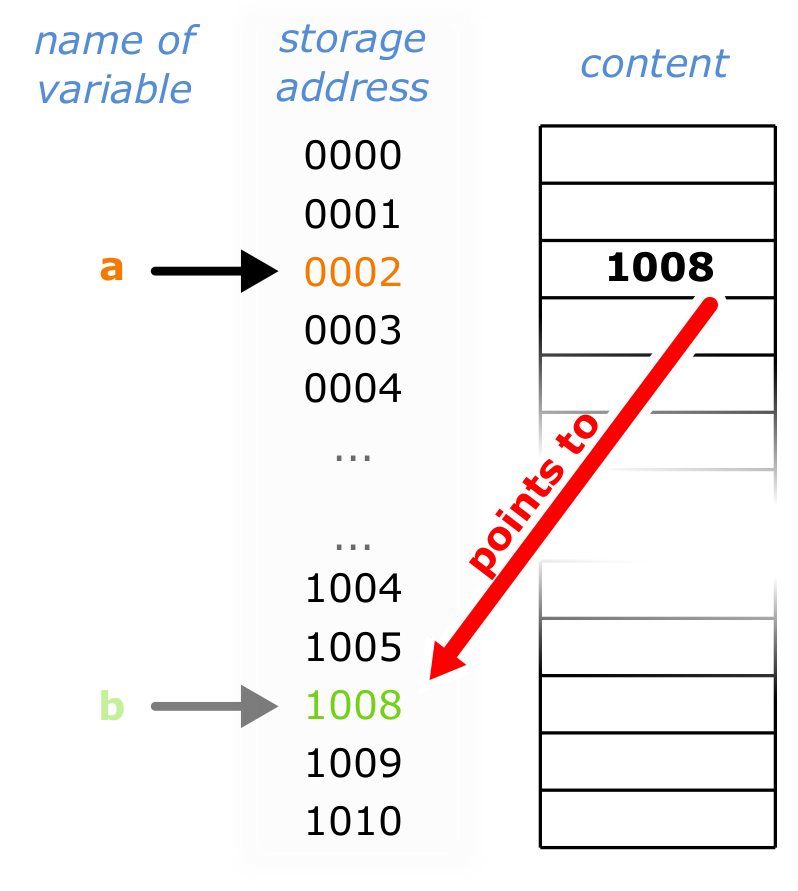
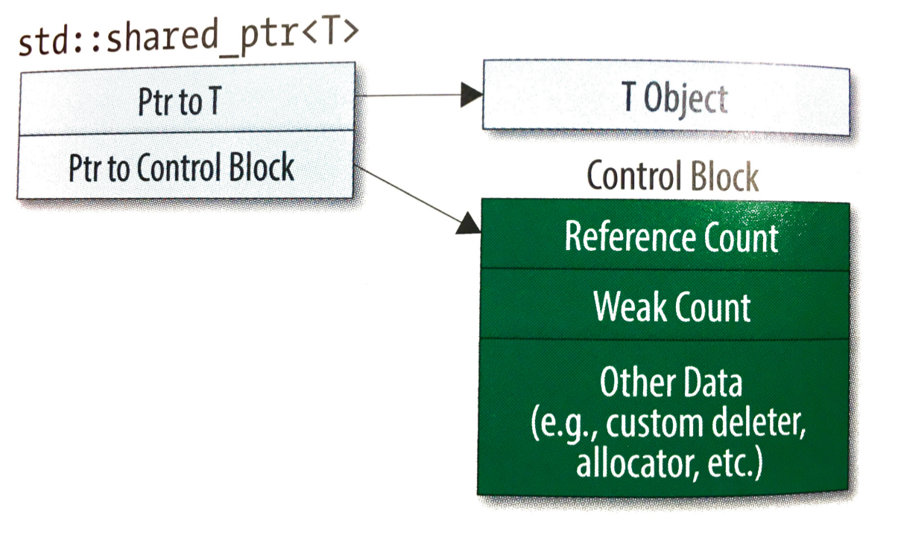

# Introduction

## What is a pointer?



A pointer is an object whose value “points to” another value stored
somewhere else in memory

-   it contains a **memory address**

-   obtaining the stored at the pointed location

-   very flexible and powerful tool

## Using a pointer

```cpp
    /* Defining a pointer */
    int* a; // declares a pointer that can point to an integer value
    //DANGER: the pointer points to a random memory portion!
    
    int* b = nullptr; // OK, pointer is initialised to a null memory address

    int* c = new int; // allocate memory for an integer value in the heap
    //and assign its memory address to this pointer
    
    int** d = &a; // this pointer points to a pointer to an integer value
    
    MyObject* e = new MyObject(); // allocate memory for MyObject
    // and assign its memory address to the pointer e
    
    /* Using a pointer */
    int f = *c; // dereferencing a pointer and assigning the pointed
    // value to another integer variable
    
    e->DoSomething(); // dereferencing a pointer and calling
    // the method DoSomething() of the instance of MyObject
    // pointed by e
```

# Why a raw pointer is hard to love

## Memory leaks


Below is a snippet of analysis code. What is wrong with it ? 
```cpp
    void MyAnalysisTask::UserExec()
    {
      TLorentzVector* v = nullptr;
      for (int i = 0; i < InputEvent()->GetNumberOfTracks(); i++) {
        AliVTrack* track = InputEvent()->GetTrack(i);
        if (!track) continue;
        v = new TLorentzVector(track->Px(), 
          track->Py(), track->Pz(), track->M());
    
        // my analysis here
        std::cout << v->Pt() << std::endl;
      }
  
      delete v;
    }
```


Array or single value?
-   A pointer can point to a single value or to an array, there is 
    no way to infer it from its declaration
-   Different syntax to destroy (= deallocate, free) the pointed object
    for arrays and single objects

```cpp
    AliVTrack* FilterTracks();

    void UserExec()
    {
      TLorentzVector *vect = new TLorentzVector(0,0,0,0);
      double *trackPts = new double[100];
      AliVTrack *returnValue = FilterTracks();

      // here use the pointers

      delete vect;
      delete[] trackPts;
      delete returnValue; // or should I use delete[] ??
    }
```

Double deletes

-   Each memory allocation should match a corresponding deallocation

-   Difficult to keep track of all memory allocations/deallocations in a
    large project

-   **Ownership** of the pointed memory is ambiguous: multiple deletes
    of the same object may occur

```cpp
    AliVTrack* FilterTracks();
    void AnalyzeTracks(AliVTrack* tracks);

    void MyAnalysisTask::UserExec()
    {
      AliVTrack* tracks = FilterTracks();

      AnalyzeTracks(tracks);

      delete[] tracks; // should I actually delete it?? 
      //or was it already deleted by AnalyzeTracks?
    }
```



# Smart Pointers


-   Clear (*shared* or *exclusive*) **ownership** of the pointed object

-   memory is deallocated when the last pointer goes out of scope

-   Available since C++11

## Exclusive-Ownership Pointers: `unique_ptr`

-   Automatic garbage collection with (i.e. it uses the same
    resources as a raw pointer)

-   `unique_ptr` **owns** the object it points

-   Memory automatically released when `unique_ptr` goes out of scope or
    when its `reset(T* ptr)` method is called

-   Only one `unique_ptr` can point to the same memory address



Example 1

```cpp
    void MyFunction() {
      std::unique_ptr<TLorentzVector> vector(new TLorentzVector(0,0,0,0));
      std::unique_ptr<TLorentzVector> vector2(new TLorentzVector(0,0,0,0));
  
      // use vector and vector2
  
      // dereferencing unique_ptr works exactly as a raw pointer
      std::cout << vector->Pt() << std::endl;
  
      // the line below does not compile!
      // vector = vector2;
      // cannot assign the same address to two unique_ptr instances
  
      vector.swap(vector2); // however I can swap the memory addresses
  
      // this also releases the memory previously pointed by vector2
      vector2.reset(new TLorentzVector(0,0,0,0)); 
  
      // objects pointed by vector and vector2 are deleted here
    }
```

Example 2

```cpp
    void MyAnalysisTask::UserExec()
    {
      for (int i = 0; i < InputEvent()->GetNumberOfTracks(); i++) {
        AliVTrack* track = InputEvent()->GetTrack(i);
        if (!track) continue;
        std::unique_ptr<TLorentzVector> v(new TLorentzVector(track->Px(), 
          track->Py(), track->Pz(), track->M()));
    
        // my analysis here
        std::cout << v->Pt() << std::endl;
        // no need to delete
        // v is automatically deallocated after each for loop
      }
    }
```

No memory leak here! :)




## Shared-Ownership Pointers: `shared_ptr`

-   Automatic garbage collection with some CPU and memory overhead

-   The pointed object is *collectively owned* by one or more
    `shared_ptr` instances

-   Memory automatically released the last `shared_ptr` goes out of
    scope or when it is re-assigned





Example 1

```cpp
    void MyFunction() {
      std::shared_ptr<TLorentzVector> vector(new TLorentzVector(0,0,0,0));
      std::shared_ptr<TLorentzVector> vector2(new TLorentzVector(0,0,0,0));
  
      // dereferencing shared_ptr works exactly as a raw pointer
      std::cout << vector->Pt() << std::endl;
  
      // assignment is allowed between shared_ptr instances
      vector = vector2; 
      // the object previously pointed by vector is deleted!
      // vector and vector2 now share the ownership of the same object
  
      // object pointed by both vector and vector2 is deleted here
    }
```

Example 2

```cpp
    class MyClass {
      public:
        MyClass();
      private:
        void MyFunction();
        std::shared_ptr<TLorentzVector> fVector;
    };

    void MyClass::MyFunction() {
      std::shared_ptr<TLorentzVector> vector(new TLorentzVector(0,0,0,0));
  
      // assignment is allowed between shared_ptr instances
      fVector = vector;
      // the object previously pointed by fVector (if any) is deleted
      // vector and fVector now share the ownership of the same object

      // here vector goes out-of-scope
      // however fVector is a class member so the object is not deleted!
      // it will be deleted automatically when this instance of the class
      // is deleted (and therefore fVector goes out-of-scope) :)
    }
```


## Some word of caution on `shared_ptr'



You have crated smart code, using smart pointers. It looks like this
```cpp
    void MyClass::MyFunction() {
      auto ptr = new TLorentzVector(0,0,0,0);
  
      std::shared_ptr<TLorentzVector> v1 (ptr);
      std::shared_ptr<TLorentzVector> v2 (ptr);
  
    }
```
still, something is wrong with it, do you know what ?



A possible way of solving this:

```cpp
    void MyFunction() {
      auto ptr = new TLorentzVector(0,0,0,0);
  
      std::shared_ptr<TLorentzVector> v1 (ptr);
      std::shared_ptr<TLorentzVector> v2 (ptr);
  
      // a double delete occurs here!
    }
```

-   `v1` does not know about `v2` and viceversa!

-   Two control blocks have been created for the same pointed objects

Some word of caution on `shared_ptr`

```cpp
    void MyFunction() {
      std::shared_ptr<TLorentzVector> v1 (new TLorentzVector(0,0,0,0));
      std::shared_ptr<TLorentzVector> v2 (v1);
  
      // this is fine!
    }
```

The lesson to learn: use raw pointers only when absolutely needed (if at all)



# Final remarks

-   When the extra-flexibility of a pointer is not needed, do not use it

-   Alternative to pointers: arguments by reference (not covered here)

-   Avoid raw pointers whenever possible!

-   Smart pointers (`unique_ptr` and `shared_ptr`) should cover most use
    cases and provide a much more robust and safe memory management
