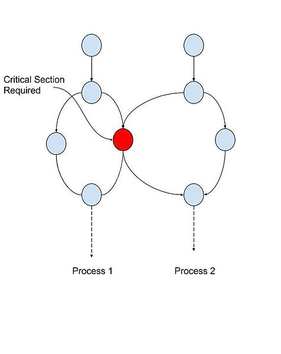
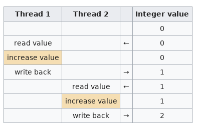
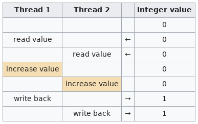

# Threads and processes

A thread of execution is the **smallest sequence of programmed instructions** that can be managed independently by the operating system. The implementation of threads and processes differs between operating systems, but in most cases **a thread is a component of a process**. 

- Multiple threads can exist within one process
- They execute concurrently and share resources such as memory 
- Different processes do not share these resources
- The threads of a process share its executable code and the values of its variables at any given time

## Multithreading

Single threading means (obviously) executing one single thread at a time. Multithreading allows multiple threads to exist within the context of one process. These threads **share the process's resources**, but are able to execute independently. 

### Advantages

* **Responsiveness**: multithreading can allow an application to remain responsive to input. 
 - In a one-thread program, if the main execution thread blocks on a long-running task, the entire application can appear to freeze. 
 - Moving the task to a worker thread,  it is possible for the application to remain responsive to user input while executing tasks in the background
 - Note: most cases multithreading is not the only way to keep a program responsive, with non-blocking I/O and/or Unix signals being available for gaining similar results
* **Faster execution**: multithreaded program allow faster operation on computer systems that have multiple CPUs or one or more multi-core processors, or across a cluster of machines
 - works only if the threads are independent, i.e. do not have to wait for one another
* **Lower resource consumption**: using threads, an application can serve multiple clients concurrently using fewer resources than it would need when using multiple process copies of itself. 
 - For example, the Apache HTTP server uses thread pools: a pool of listener threads for listening to incoming requests, and a pool of server threads for processing those requests.
* **Parallelization**: applications looking to use multicore or multi-CPU systems can use multithreading to split data and tasks into parallel subtasks and let the underlying architecture manage how the threads run, either concurrently on one core or in parallel on multiple cores. 


Contrary to intuition, multithreading can speed up processes both on single and multi CPU machines. In the former case, multi threading can be very helpful when active threads are executed, while idle threads, which are e.g. waiting on a network response, wait their turn, preventing the entire CPU from being idle. 


### Drawbacks

* **Synchronization**: since threads share the same address space, threads can *interfere*, leading to unexpected behavior
 - In order for data to be correctly manipulated, threads will often need to rendezvous in time in order to process the data in the correct order
 - Threads may also require mutually exclusive operations (often implemented using `mutexes`) in order to prevent common data from being simultaneously modified or read while in the process of being modified
* **Thread crashes a process**: an illegal operation performed by a thread crashes the entire process; therefore, one misbehaving thread can disrupt the processing of all the other threads in the application.


Threads in the same process share the same **address space**. This allows **concurrently** running code to efficiently exchange data. 

When shared between threads, however, even simple data structures become prone to **race conditions** if they require **more than one CPU instruction to update**: 
- Two threads may end up attempting to update the data structure at the same time and find it unexpectedly changing underfoot
- Bugs caused by race conditions can be very difficult to reproduce and isolate.

Race conditions are often a result of two threads operating within their **critical section** simultaneously:

Let's look at this in practice and assume that two threads want to increment the value of a global integer variable by one. **This operation requires several CPU instructions**. Ideally, the following sequence of operations would take place

However, if the two threads run simultaneously **without locking or synchronization**, the outcome of the operation could be wrong

To prevent this, threading application programming interfaces (APIs) offer synchronization primitives such as
 `mutexes` to lock data structures against concurrent access. 

## Mutexes

Mutex is a portmanteau of 'mutual exclusion': **one thread of execution never enter its critical section at the same time that another concurrent thread of execution enters its own critical section**.
- On uniprocessor systems, a thread running into a locked mutex must sleep
-  On multi-processor systems, the thread may instead poll the mutex in a `spinlock` which intermittently checks if the mutex has been released

Several mutexes exist, ones that you often see or hear about
- Locks (usually just called `mutex`), behaving as described above
- Semaphores: simple data types. Consider a variable A and a boolean variable S. A is only accessed when S is marked true. Thus, S is a semaphore for A
- ....  many more (but we are not computer scientists)

Mutexes make your code safe for race conditions, but as a trade-off, they can lead to **deadlocks**. 

A deadlock is a state in which each member of a group is waiting for some other member to take action, such as sending a message or more commonly releasing a lock. 

Conversely, one can also run into a **livelock**, where  the states of the processes involved in the livelock constantly change with regard to one another, none progressing. 

Most OSs **cannot prevent deadlocks**, and can have trouble to even diagnose them. Deadlocks, livelocks, and race conditions are very hard to diagnose. 



Hopefully, by now, you have a good idea of what multi threading and multi processing entails, what are the benefits, and what are the difficulties. Let's write our own little multi threader program now!
